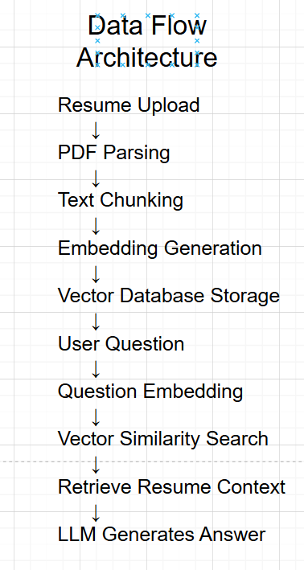

# AI-Powered Resume Screening Tool using RAG

## Overview

This project implements an AI powered **Resume Screening Tool** that helps recruiters quickly evaluate candidates by comparing resumes with job descriptions.

The system uses **Retrieval Augmented Generation (RAG)** to analyze resumes and answer recruiter queries intelligently.

Users can:

* Upload a **Resume (PDF/TXT)**
* Upload a **Job Description (PDF/TXT)**
* View **Match Score, Strengths, and Skill Gaps**
* Ask questions about the candidate using **AI powered chat**

# Architecture Overview

The system consists of three main components:

Frontend → React
Backend API → Node.js (Express)
AI Service → Python (RAG pipeline)

System architecture:

React Frontend
↓
Node.js Express API
↓
Python RAG Service
↓
Vector Database (Chroma)
↓
LLM based Answer Generation

---

# RAG Workflow

The system implements **Retrieval Augmented Generation** to ensure accurate answers.

Step 1  Document Processing
Resumes and job descriptions are uploaded and parsed from PDF to text.

Step 2  Text Chunking
Resume text is divided into smaller sections (chunks).

Step 3  Embedding Generation
Each chunk is converted into vector embeddings using SentenceTransformers.

Step 4  Vector Storage
Embeddings are stored in a **Chroma vector database**.

Step 5 Query Processing
When a recruiter asks a question, the question is converted into an embedding.

Step 6  Vector Retrieval
The system searches the vector database to retrieve the most relevant resume sections.

Step 7  Augmented Generation
The retrieved context is passed to the LLM to generate an accurate response.

RAG Pipeline:

Resume → Chunking → Embeddings → Vector DB
User Question → Embedding → Vector Search → Context Retrieval → LLM Answer

This ensures the system retrieves **relevant resume sections instead of sending the entire resume to the LLM**.

---

# Features

Resume Upload
Upload a candidate resume in PDF or TXT format.

Job Description Upload
Upload a job description to compare candidate suitability.

Match Score Calculation
The system calculates a match score based on job requirements and resume skills.

Strengths Detection
Identifies candidate strengths relative to the job description.

Skill Gap Analysis
Detects missing skills or experience.

AI Chat Interface
Recruiters can ask questions about the candidate using natural language.

Context Aware Responses
Chat responses are generated using retrieved resume context.

---

# Technology Stack

Frontend
React.js

Backend API
Node.js
Express.js

AI / RAG System
Python
Sentence Transformers
LangChain
FastAPI

Vector Database
ChromaDB

PDF Processing
pdfminer.six

---

# Project Structure

resume-rag-project

backend-node
 routes
 upload.js
 chat.js
 server.js
 uploads

backend-python
 rag_service.py
 parser.py
 requirements.txt

frontend
React application for UI

sample-data
Sample resumes and job descriptions for testing

README.md

---

# API Endpoints

Upload Resume and Job Description

POST /upload

Uploads resume and job description for analysis.

Response example:

{
"match_score": 75,
"strengths": ["React", "Node.js"],
"gaps": ["AWS", "Kubernetes"]
}

---

Chat Query

POST /chat

Allows recruiters to ask questions about the candidate.

Example request:

{
"question": "Does this candidate have experience with React?"
}

Example response:

{
"answer": "Yes, the candidate has approximately 3 years of experience with React.js."
}

---

# Setup Instructions

## 1. Clone Repository

git clone <repository-url>

cd resume-rag-project

---

## 2. Run Python RAG Service

cd backend-python

Create virtual environment:

python -m venv venv

Activate environment:

Windows
venv\Scripts\activate

Install dependencies:

pip install -r requirements.txt

Run the RAG service:

uvicorn rag_service:app --reload --port 8000

---

## 3. Run Node Backend

cd backend-node

Install dependencies:

npm install

Start server:

node server.js

Backend will run on:

http://localhost:5000

---

## 4. Run Frontend

cd frontend

Install dependencies:

npm install

Start React app:

npm start

Frontend runs on:

http://localhost:3000

---

# Sample Files

The repository includes sample files for testing:

sample-data/

resume1.pdf
resume2.pdf
job_description.pdf

---

# Demo

The demo video shows:

Upload Resume and Job Description
Match score analysis
Strengths and skill gap detection
AI chat answering recruiter questions

---

# Author

Meenakshi Vejendla
B.Tech Computer Science (AI & ML)
VIT-AP University
